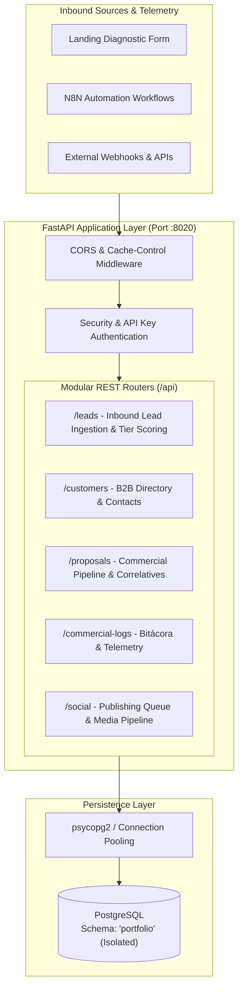

# CORALIS-PS — Operational CRM & Telemetry Microservice

[](https://www.python.org/)
[](https://fastapi.tiangolo.com/)
[](https://www.postgresql.org/)
[](https://www.sqlalchemy.org/)
[](https://docs.pydantic.dev/)
[](https://opensource.org/licenses/MIT)

A modular, high-performance **FastAPI backend microservice** built for B2B consulting operations, automated inbound lead ingestion, commercial telemetry, and seamless integration with **n8n / workflow automation pipelines**.

Developed with clean architecture principles, strict type validation, and multi-tenant database isolation to eliminate manual rework in professional service operations.

---

## 🏗️ Architecture & Data Flow



---

## ⚡ Key Technical Features

1. **Strict Type Safety & Schema Validation:**  
   Full request and response modeling using **Pydantic**, ensuring zero unexpected payloads across all REST endpoints.
2. **Schema-Isolated Multi-Tenancy:**  
   Database queries run under dedicated PostgreSQL schemas (`search_path=portfolio,public`), preventing crosstalk with existing corporate databases.
3. **Automated Commercial Scoping & Tier Scoring:**  
   Inbound leads received via `/api/v1/leads` or `/api/leads` are dynamically parsed, deduplicated, and mapped to operational service tiers (`Quick-Win Audit`, `Core Transformation`, `Fractional Retainer`).
4. **Resilient Middleware Architecture:**  
   Includes custom HTTP middleware for instant SPA cache invalidation (`Cache-Control: no-cache, no-store`) and robust Cross-Origin Resource Sharing (CORS) for webhook triggers.
5. **Integrated Static Dashboard Mounting:**  
   FastAPI serves both the OpenAPI/Swagger documentation and the native browser-based management SPA from a single deployable unit.

---

## 📁 Project Structure

```text
Portfolio_CRM/
├── app/
│   ├── main.py                     # FastAPI application entrypoint & middleware
│   ├── database.py                 # PostgreSQL connection manager & context handlers
│   ├── routers/
│   │   ├── auth.py                 # Session & authentication router
│   │   ├── commercial_logs.py      # Telemetry & client interaction bitácora
│   │   ├── compat.py               # Legacy integration compatibility layer
│   │   ├── customers.py            # B2B client and contact directory
│   │   ├── leads.py                # Automated lead capture & tier scoring engine
│   │   ├── proposals.py            # Commercial proposal pipeline & tracking
│   │   └── social_publisher.py     # Social media dispatch & queue handlers
│   ├── services/                   # Business logic & helper modules
│   └── static/                     # Web dashboard assets & diagnostic interface
├── .env.example                    # Clean environment configuration template
├── .gitignore                      # Strict credential & bytecode protection
├── requirements.txt                # Production Python dependencies
└── run_server.py                   # Development server runner
```

---

## 🚀 Quick Start Guide

### 1. Prerequisites
* Python 3.10, 3.11, or 3.12
* PostgreSQL 14+ (or compatible Docker container)
* Git

### 2. Clone & Environment Setup
```bash
git clone https://github.com/falarcode-ops/fastapi-operations-service.git
cd fastapi-operations-service

# Create and activate virtual environment
python -m venv venv

# On Linux/macOS:
source venv/bin/activate
# On Windows (PowerShell):
.\venv\Scripts\Activate.ps1
```

### 3. Install Dependencies
```bash
pip install --upgrade pip
pip install -r requirements.txt
```

### 4. Configure Environment Variables
Copy the template and configure your local database credentials:
```bash
cp .env.example .env
```
Edit `.env` with your preferred text editor:
```env
DB_HOST=localhost
DB_PORT=5432
DB_NAME=crm_db
DB_SCHEMA=portfolio
DB_USER=postgres
DB_PASSWORD=your_secure_password
API_HOST=0.0.0.0
API_PORT=8020
```

### 5. Run the Server
```bash
# Using Python runner:
python run_server.py

# Or directly with Uvicorn:
uvicorn app.main:app --host 0.0.0.0 --port 8020 --reload
```

---

## 📖 Interactive API Documentation

Once the server is running, explore the interactive documentation:
* **Swagger UI:** [http://localhost:8020/docs](http://localhost:8020/docs)
* **ReDoc:** [http://localhost:8020/redoc](http://localhost:8020/redoc)
* **Health Check:** [http://localhost:8020/health](http://localhost:8020/health)

---

## 👨‍💻 Author & Engineering Profile

**Fabián Andrés Alarcón Chávez**  
*Industrial Engineer | Operations, Business Process Standardization (ISO 9001) & Automation Specialist*  

* **GitHub:** [@falarcode-ops](https://github.com/falarcode-ops)  
* **LinkedIn:** [Fabián Alarcón](https://www.linkedin.com/in/fabian-alarcon-alacor/)  
* **Email:** [falarcon.apps2024@gmail.com](mailto:falarcon.apps2024@gmail.com)  
* **Portfolio & Diagnostic:** [https://meet.google.com/tdn-ofwt-dex](https://meet.google.com/tdn-ofwt-dex)

---

## 📄 License
This project is open-source and available under the terms of the [MIT License](LICENSE).  
Copyright (c) 2026 Fabián Andrés Alarcón Chávez (`falarcode-ops`).
